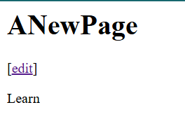
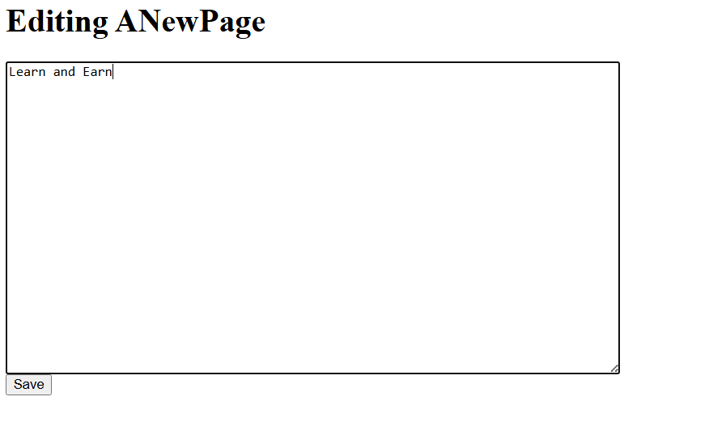
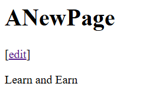

# Writing Web Applications
[Go Documentation: ](https://go.dev/doc/articles/wiki/)tutorial on building web applications with ```net/http```.<br>

## Topics covered in this tutorial:
- Creating a data structure with load and save methods
- Using the net/http package to build web applications
- Using the html/template package to process HTML templates
- Using the regexp package to validate user input
- Using closures


Go to: http://localhost:8080/view/ANewPage <br>

<br>
Edit:<br>

<br>
Save: <br>

